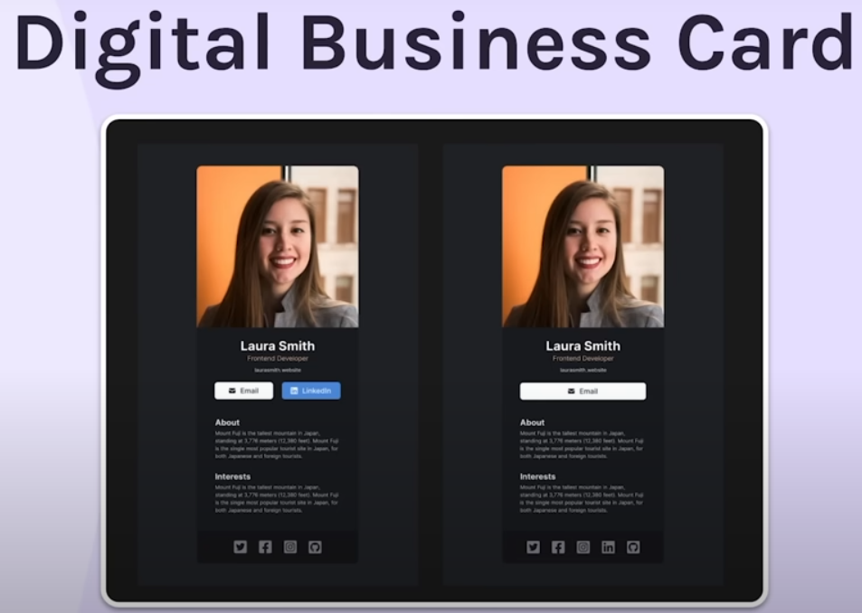

# [Digital Business Card](https://kalafriz.github.io/fsd-roadmap/learn-react-scrimba/digital-business-card/src/index.html) | React

### About:
 Simple digital business card React app. See requirements.

### Packages:
- React, Babel

### Notes:
- Have yet to configure React for GitHub pages for this, so page is not live.

### Requirements
Fulfilling the guidelines from [this tutorial](https://www.youtube.com/watch?v=bMknfKXIFA8&ab_channel=freeCodeCamp.org) via freeCodeCamp.org.
- Build from scratch
- Use own info
- Make separate components for:
  - Info (photo, name, buttons, etc.)
  - About
  - Interests
  - Footer (social icons)

### Reference:

